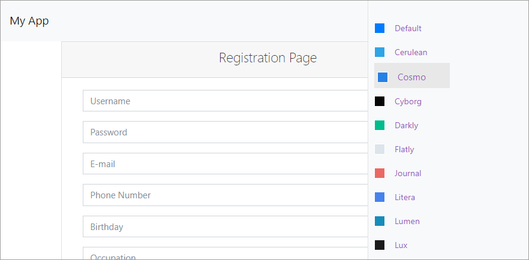

<!-- default badges list -->

[](https://supportcenter.devexpress.com/ticket/details/T547560)
[](https://docs.devexpress.com/GeneralInformation/403183)
<!-- default badges end -->
# Bootstrap Controls - How to implement Theme Switcher


This example demonstrates how to create the Bootstrap Theme Switcher user control like in our [Devexpress Bootstrap demos](https://demos.devexpress.com/Bootstrap/GridView/). All themes are taken from the [Bootswatch web site](https://bootswatch.com/). The selected theme name is stored in cookies.



Follow the steps below to add the theme switcher to your application:


1. Add all the following files in the [App_Code](./CS/App_Code) directory: 
    * [BootstrapThemeModel.cs](./CS/App_Code/BootstrapThemeModel.cs)
    * [BundleConfig.cs](./CS/App_Code/BundleConfig.cs)
    * [ThemeModelBase.cs](./CS/App_Code/ThemeModelBase.cs)

2. Add the _BootstrapThemeSwitcher_ user control  to your application, register and add it on the page. In this example, it's registered and added in the [Site.master](./CS/Site.master) master page. 

    ```html
    <%@ Register Src="~/BootstrapThemeSwitcher.ascx" TagPrefix="bts" TagName="BootstrapThemeSwitcher" %>
    ...
    <bts:BootstrapThemeSwitcher ID="SuperBootstrapThemeSwitcher" runat="server" />
    ```
3. Add the [SwitcherResources](./CS/SwitcherResources) folder to your application. The folder contains the client resources required for the theme switcher and a list of available Bootstrap themes.

## Files to Review

* [Site.master](./CS/Site.master) (VB: [Site.master](./VB/Site.master))
* [Site.master.cs](./CS/Site.master.cs) (VB: [Site.master.vb](./VB/Site.master.vb))
* [BootstrapThemeSwitcher.ascx](./CS/BootstrapThemeSwitcher.ascx) (VB: [BootstrapThemeSwitcher.ascx](./VB/BootstrapThemeSwitcher.ascx))
* [BootstrapThemeSwitcher.ascx.cs](./CS/BootstrapThemeSwitcher.ascx.cs) (VB: [BootstrapThemeSwitcher.ascx.vb](./VB/BootstrapThemeSwitcher.ascx.vb))


